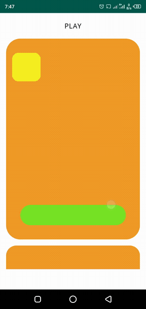

# AnimationTest

A simple animation implementation for Android

 

## How To Use

Clone repo directly

### :heart: Found this project useful?

If you found this project useful, then please consider giving it a :star: on Github and sharing it with your friends via social media.

## Project Created & Maintained By

### John E. Okore

# Donate

> If you found this project helpful or you learned something from the source code and want to thank me, consider buying me a cup of :coffee:
>
> - [Ravepay](https://rave.flutterwave.com/donate/oumg0prh9wta)

